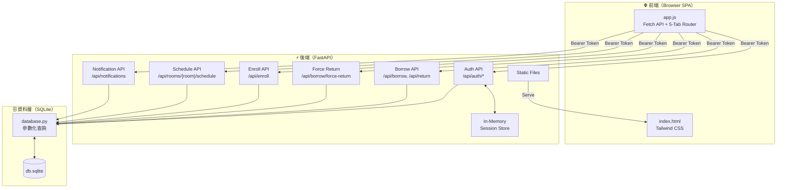
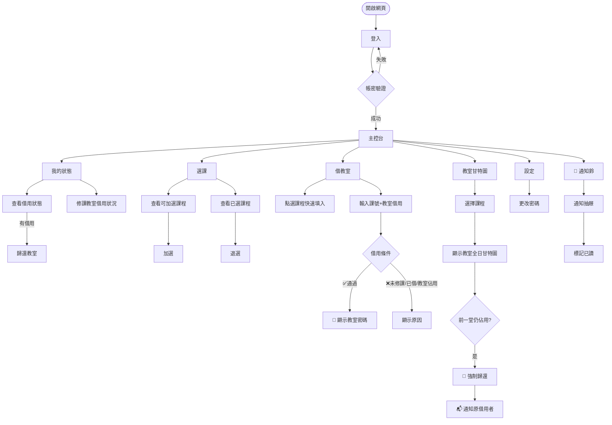
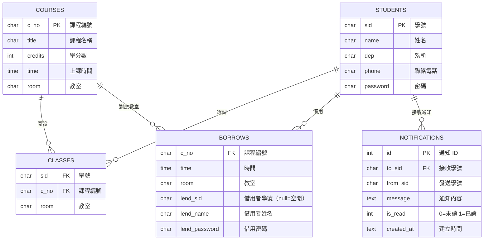

# 學生個人管理系統

> 國立高雄科技大學（NKUST）學生個人管理系統，整合線上**選課**、**借教室**與**教室排程甘特圖**，支援強制歸還與即時通知功能。

---

## 系統版本

| 版本 | 介面 | 功能 |
|------|------|------|
| **V1** | 命令列（CLI） | 借教室、還教室 |
| **V2** | 網頁前後端（Web SPA） | 選課、借/還教室、甘特圖排程、強制歸還、即時通知 |

---

## 快速啟動（V2）

```bash
cd v2
pip install -r requirements.txt
python seed.py          # 初始化測試資料（只需執行一次）
uvicorn main:app --reload
```

開啟瀏覽器：`http://localhost:8000`
互動式 API 文件：`http://localhost:8000/docs`

**測試帳號：**

| 學號 | 密碼 | 說明 |
|------|------|------|
| `0341055` | `u0341055` | 主要測試帳號（金融系，修 E117、D202 課程） |
| `D000002` | `demo1` | demo_lin（資管系，修 E117、E118、E211） |
| `D000003` | `demo2` | demo_chen（資管系，修 E211、E212、B301） |
| `D000004` | `demo3` | demo_wang（金融系，修 D202、E117） |
| `D000005` | `demo4` | demo_lee（會計系，修 C401、E212） |
| `D000006` | `demo5` | demo_wu（資管系，修 E212、B301） |
| `D000007` | `demo6` | demo_zhang（金融系，修 D202、E118） |

---

## 系統架構



---

## 使用者操作流程



---

## 教室甘特圖說明

甘特圖時間軸為 **08:00 – 21:00**，每門課依照上課時段用色塊呈現：

| 顏色 | 說明 |
|------|------|
| 🟢 綠色 | 教室空閒，可借用 |
| 🟣 靛色 | 我目前借用中 |
| 🟡 黃色 | 他人借用中（無法強制歸還） |
| 🔴 紅色 | 他人借用中，且我的課緊接在後 → 可強制歸還 |

**強制歸還觸發條件：**
- 教室被他人借走
- 我修了該教室的下一堂課
- 下一堂上課時間 ≥ 上一堂結束時間（起始時間 + 學分小時數 − 10分）

---

## 資料庫結構



---

## API 端點（V2）

| 方法 | 路徑 | 說明 | 需登入 |
|------|------|------|--------|
| `POST` | `/api/auth/login` | 登入，取得 Bearer Token | ✗ |
| `POST` | `/api/auth/logout` | 登出 | ✓ |
| `PUT` | `/api/auth/password` | 更改密碼 | ✓ |
| `GET` | `/api/borrow/me` | 我目前的借用狀態 | ✓ |
| `POST` | `/api/borrow` | 借教室 | ✓ |
| `POST` | `/api/return` | 歸還教室 | ✓ |
| `POST` | `/api/borrow/force-return` | 強制歸還（接續課程者） | ✓ |
| `GET` | `/api/courses/me` | 我的修課清單 | ✓ |
| `GET` | `/api/courses/available` | 可加選課程 | ✓ |
| `POST` | `/api/enroll` | 加選課程 | ✓ |
| `DELETE` | `/api/enroll/{c_no}` | 退選課程 | ✓ |
| `GET` | `/api/rooms/{room}/schedule` | 教室全日排程（甘特圖資料） | ✓ |
| `GET` | `/api/borrows/my-rooms` | 修課教室的借用狀況 | ✓ |
| `GET` | `/api/notifications` | 我的通知列表 | ✓ |
| `POST` | `/api/notifications/read` | 標記通知已讀 | ✓ |

---

## 專案結構

```
BorrowRoom/
├── borrow.py              # V1 入口
├── lib.py                 # V1 核心邏輯（已優化：修復 SQL Injection、secrets 等）
├── db.sqlite              # 共用 SQLite 資料庫
├── instruction.txt        # V1 使用說明
└── v2/
    ├── main.py            # FastAPI 後端（16 個 API 端點）
    ├── database.py        # 資料庫操作層（參數化查詢）
    ├── models.py          # Pydantic 請求模型
    ├── seed.py            # 測試資料初始化腳本
    ├── requirements.txt   # Python 套件需求
    └── static/
        ├── index.html     # 前端 SPA（5-Tab + 通知抽屜）
        └── app.js         # 前端邏輯（Tab 路由、甘特圖、選課、通知輪詢）
```

---

## V1 → V2 改善對照

| 項目 | V1（CLI） | V2（Web） |
|------|-----------|-----------|
| 介面 | Terminal | 瀏覽器 5-Tab SPA |
| 認證 | 每次輸入帳密 | Bearer Token（localStorage）|
| SQL | 字串格式化（Injection 風險）| 參數化查詢 |
| 密碼產生 | `random.random()` | `secrets.token_hex()` |
| 選課 | ✗ | ✓ 加選 / 退選 |
| 教室排程 | ✗ | ✓ 甘特圖（08:00–21:00）|
| 強制歸還 | ✗ | ✓ 接續課程者可強制歸還 |
| 通知系統 | ✗ | ✓ 即時通知 + 30 秒輪詢 |
| 測試資料 | 原始少量資料 | 7 教室、21 課程、5 demo 學生 |
