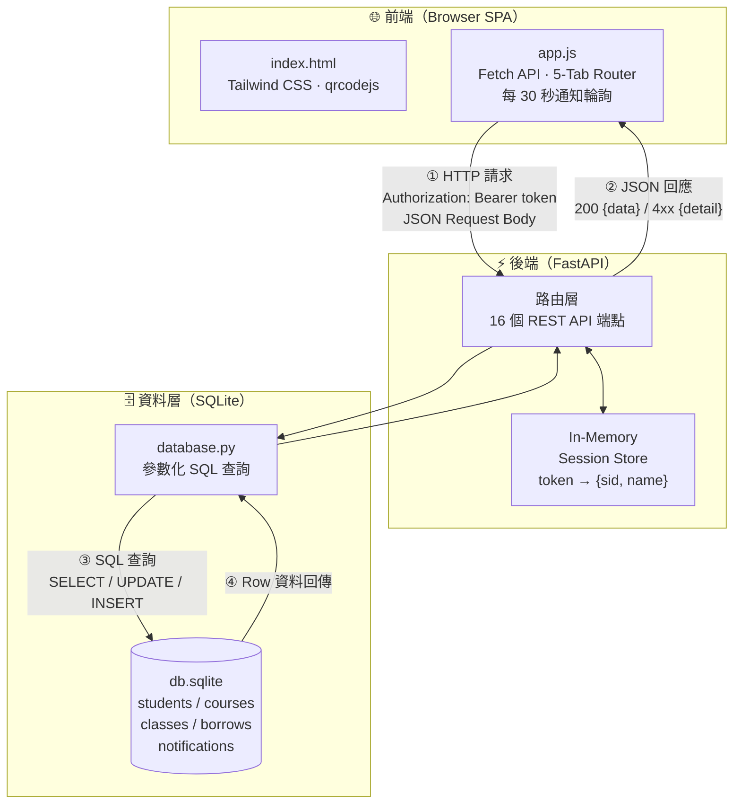
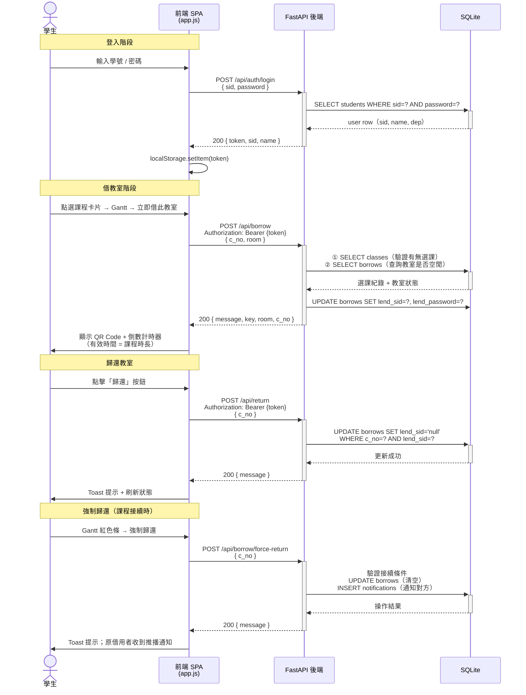
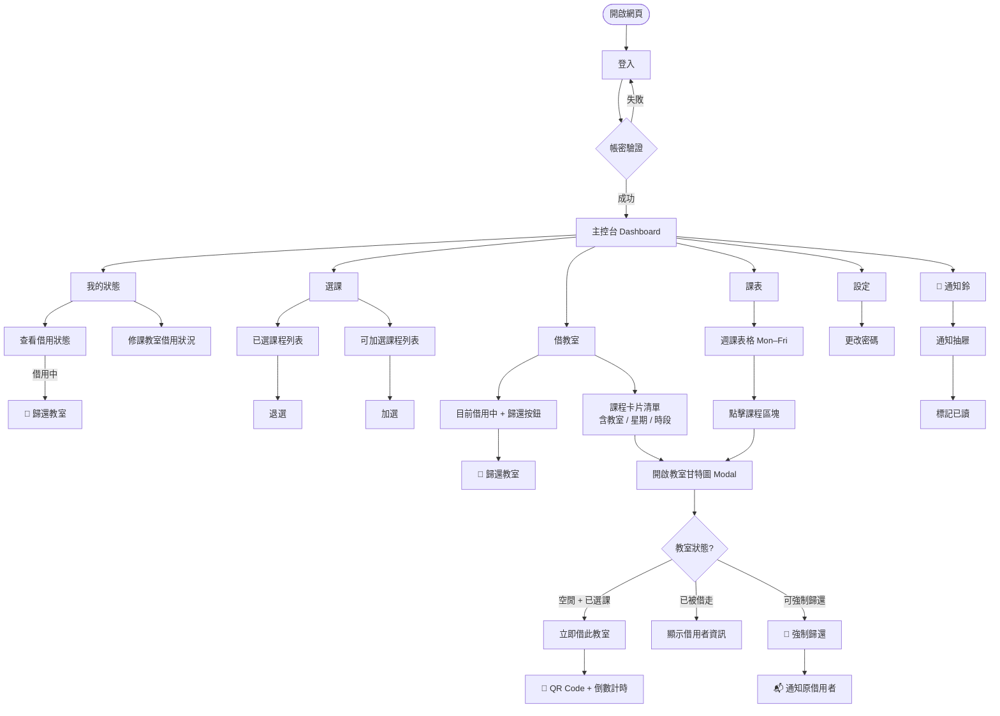

# 學生個人管理系統

> 大學學生個人管理系統，整合線上**選課**、**借教室**與**週課表排程**，支援即時 QR Code 開門、強制歸還與推播通知。

---

## 系統版本

| 版本 | 介面 | 功能 |
|------|------|------|
| **V1** | 命令列（CLI） | 借教室、還教室 |
| **V2** | 網頁前後端（Web SPA） | 選課、借/還教室、週課表、甘特圖、QR Code 開門、強制歸還、即時通知 |

---

## 快速啟動（V2）

```bash
cd v2
pip install -r requirements.txt
python init_db.py          # 初始化 demo 資料庫（只需執行一次）
uvicorn main:app --reload
```

開啟瀏覽器：`http://localhost:8000`  
互動式 API 文件：`http://localhost:8000/docs`

**測試帳號：**

| 學號 | 密碼 | 系所 | 修課教室 |
|------|------|------|------|
| `0341055` | `u0341055` | 金融系 | E117 · D202 |
| `D000002` | `demo1` | 資管系 | E117 · E118 · E211 |
| `D000003` | `demo2` | 資管系 | E211 · E212 · B301 |
| `D000004` | `demo3` | 金融系 | D202 · E117 |
| `D000005` | `demo4` | 會計系 | C401 · E212 |
| `D000006` | `demo5` | 資管系 | E212 · B301 |
| `D000007` | `demo6` | 金融系 | D202 · E118 |

---

## 系統架構



---

## 前後端資料流

以「借教室」為例，完整說明一次 HTTP 往返的資料流向：



---

## 使用者操作流程



---

## QR Code 開門機制

借教室成功後系統自動產生限時 QR Code：

| 欄位 | 說明 |
|------|------|
| `room` | 教室名稱（例：E117） |
| `key` | 隨機 6-byte hex 密鑰（`secrets.token_hex(6)`） |
| `c_no` | 課程編號 |
| `exp` | 到期時間戳（`Date.now() + 課程時長 ms`） |

- **有效時長**：課程學分 × 60 分鐘 − 10 分鐘（例：3 學分 = 170 分鐘）
- **門禁端**：掃描後解析 JSON，驗證 `key` 與 `exp` 是否在有效期內再開門
- **備用方式**：無法掃碼時可手動輸入備用密碼

---

## 教室甘特圖說明

甘特圖時間軸為 **08:00 – 21:00**，每門課依借用狀態顯示不同顏色：

| 顏色 | 說明 |
|------|------|
| 🟢 綠色 | 教室空閒，可借用 |
| 🟣 靛色 | 我目前借用中 |
| 🟡 黃色 | 他人借用中（無法強制歸還） |
| 🔴 紅色 | 他人借用中，且我的課緊接在後 → 可強制歸還 |

**強制歸還條件（三項同時成立）：**
1. 教室目前被他人借用
2. 我有修該教室的下一堂課
3. 我的課程起始時間 ≥ 當前借用課程的結束時間（`起始 + 學分×60 − 10 分`）

---

## 資料庫結構

```mermaid
erDiagram
    STUDENTS {
        char sid PK "學號"
        char name "姓名"
        char dep "系所"
        char phone "聯絡電話"
        char password "密碼"
    }
    COURSES {
        char c_no PK "課程編號"
        char title "課程名稱"
        int  credits "學分數"
        time time "上課時間"
        char room "教室"
        int  weekday "星期（1=週一…5=週五）"
    }
    CLASSES {
        char sid FK "學號"
        char c_no FK "課程編號"
        char room "教室"
    }
    BORROWS {
        char c_no PK_FK "課程編號（主鍵）"
        time time "上課時間"
        char room "教室"
        char lend_sid "借用者學號（null=空閒）"
        char lend_name "借用者姓名"
        char lend_password "借用密碼"
    }
    NOTIFICATIONS {
        int  id PK "通知 ID"
        char to_sid FK "接收者學號"
        char from_sid "發送者學號"
        text message "通知內容"
        int  is_read "0=未讀 / 1=已讀"
        text created_at "建立時間"
    }

    STUDENTS ||--o{ CLASSES       : "選課"
    COURSES  ||--o{ CLASSES       : "開設"
    COURSES  ||--|| BORROWS       : "對應教室狀態"
    STUDENTS ||--o{ NOTIFICATIONS : "接收通知"
```

---

## API 端點（V2）

| 方法 | 路徑 | 說明 | 需登入 | 請求 Body | 回應 |
|------|------|------|--------|-----------|------|
| `POST` | `/api/auth/login` | 登入，取得 Bearer Token | ✗ | `{sid, password}` | `{token, sid, name}` |
| `POST` | `/api/auth/logout` | 登出，清除 Session | ✓ | — | `{message}` |
| `PUT` | `/api/auth/password` | 更改密碼 | ✓ | `{new_password}` | `{message}` |
| `GET` | `/api/borrow/me` | 我目前所有借用紀錄 | ✓ | — | `{borrows: [...]}` |
| `POST` | `/api/borrow` | 借教室 | ✓ | `{c_no, room}` | `{message, key, room, c_no}` |
| `POST` | `/api/return` | 歸還指定教室 | ✓ | `{c_no}` | `{message}` |
| `POST` | `/api/borrow/force-return` | 強制歸還（接續課程者） | ✓ | `{c_no}` | `{message}` |
| `GET` | `/api/courses/me` | 我的修課清單 | ✓ | — | `{courses: [...]}` |
| `GET` | `/api/courses/available` | 可加選課程 | ✓ | — | `{courses: [...]}` |
| `POST` | `/api/enroll` | 加選課程 | ✓ | `{c_no}` | `{message}` |
| `DELETE` | `/api/enroll/{c_no}` | 退選課程 | ✓ | — | `{message}` |
| `GET` | `/api/rooms/{room}/schedule` | 教室排程（甘特圖資料），可加 `?weekday=N` | ✓ | — | `{schedule: [...]}` |
| `GET` | `/api/borrows/my-rooms` | 修課教室的借用狀況 | ✓ | — | `{borrows: [...]}` |
| `GET` | `/api/notifications` | 我的通知列表 | ✓ | — | `{notifications: [...], unread: N}` |
| `POST` | `/api/notifications/read` | 標記通知已讀 | ✓ | `{notif_id?}` | `{message}` |

---

## 專案結構

```
BorrowRoom/
├── borrow.py              # V1 入口
├── lib.py                 # V1 核心邏輯（已優化：SQL Injection、secrets 修復）
├── db.sqlite              # 共用 SQLite 資料庫（.gitignore 中，不上傳）
├── instruction.txt        # V1 使用說明
└── v2/
    ├── main.py            # FastAPI 後端（15 個 API 端點）
    ├── database.py        # 資料庫操作層（參數化查詢）
    ├── models.py          # Pydantic 請求模型
    ├── init_db.py         # Demo 資料庫初始化（7 教室、22 課程、7 學生）
    ├── seed.py            # 呼叫 init_db 的捷徑腳本
    ├── requirements.txt   # Python 套件需求
    └── static/
        ├── index.html     # 前端 SPA（5-Tab + 通知抽屜 + QR Modal）
        └── app.js         # 前端邏輯（Tab 路由、週課表、甘特圖、QR 倒數、通知輪詢）
```

---

## V1 → V2 改善對照

| 項目 | V1（CLI） | V2（Web） |
|------|-----------|-----------|
| 介面 | Terminal | 瀏覽器 5-Tab SPA + Dark Mode |
| 認證 | 每次輸入帳密 | Bearer Token（localStorage）|
| SQL 安全 | 字串格式化（Injection 風險）| 參數化查詢 `?` |
| 密碼產生 | `random.random()` | `secrets.token_hex(6)` |
| 選課 | ✗ | ✓ 加選 / 退選，含衝突保護 |
| 借用限制 | 全局一人一間 | 每間教室同時僅一人，同學可借多間 |
| 教室排程 | ✗ | ✓ 週課表格（Mon–Fri × 08:00–20:00）|
| 甘特圖 | ✗ | ✓ 教室日視圖（08:00–21:00），點課程 Block 觸發 |
| 開門機制 | 顯示密碼 | ✓ 限時 QR Code（課程時長倒數）+ 備用密碼 |
| 強制歸還 | ✗ | ✓ 接續課程者可強制歸還，自動通知原借用者 |
| 通知系統 | ✗ | ✓ 即時推播 + 30 秒輪詢 |
| 深色模式 | ✗ | ✓ 自動偵測系統主題 + 手動切換 |
