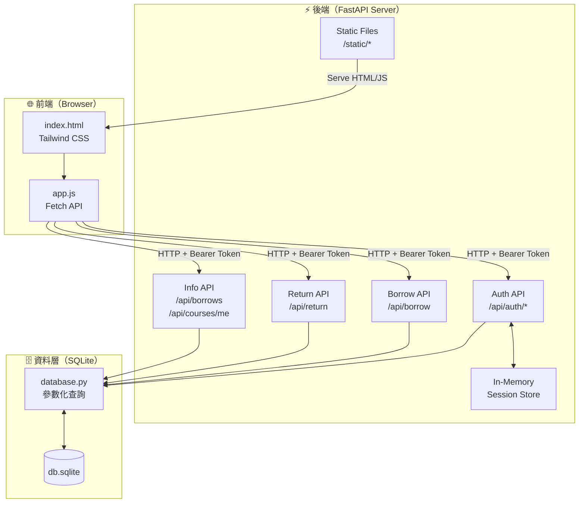
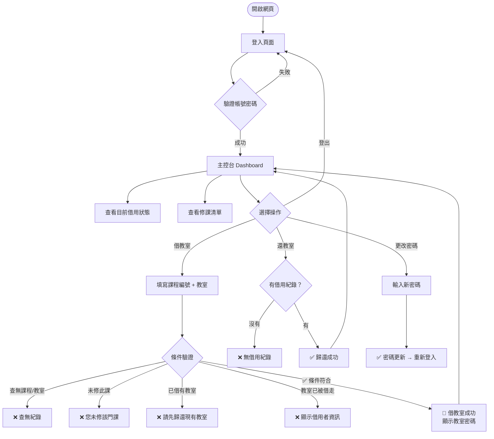
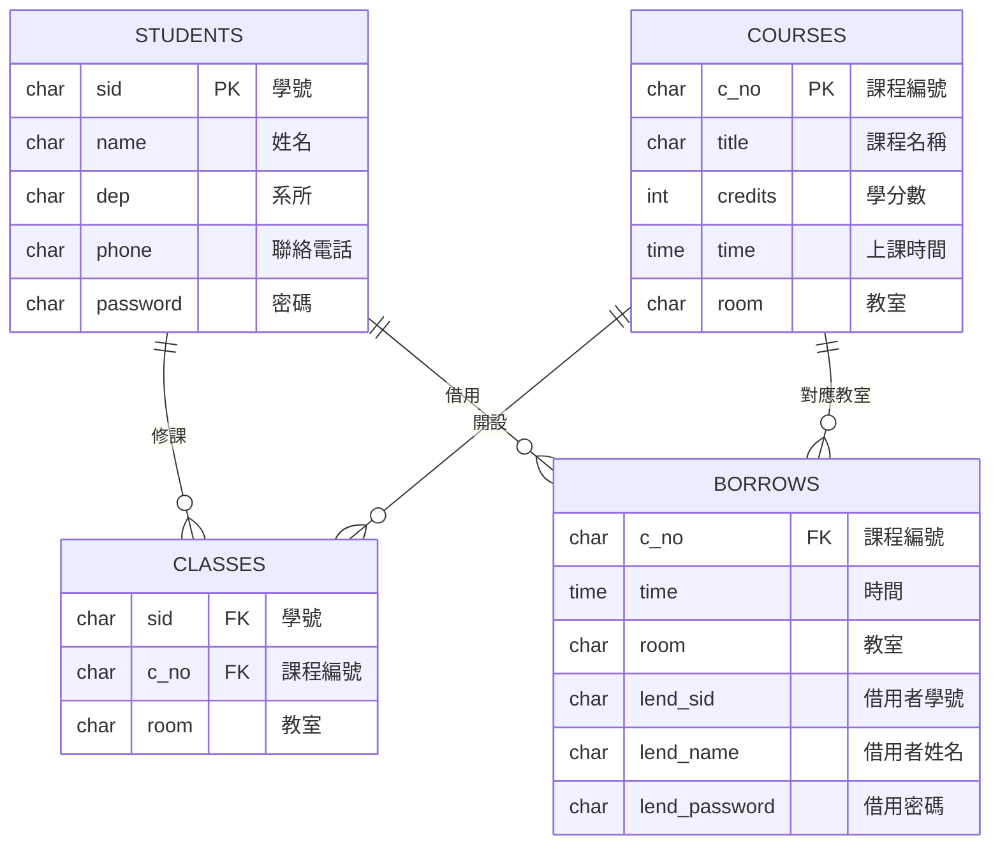

# 高科線上借教室系統

> 國立高雄科技大學（NKUST）教室線上借用系統，提供學生以學號登入並借還教室的服務。

---

## 系統版本

| 版本 | 介面 | 啟動方式 |
|------|------|----------|
| **V1** | 命令列（CLI） | `python borrow.py` |
| **V2** | 網頁前後端（Web） | `cd v2 && uvicorn main:app --reload` |

---

## V2 系統架構



---

## 使用者操作流程



---

## 資料庫結構



---

## API 端點（V2）

| 方法 | 路徑 | 說明 | 需登入 |
|------|------|------|--------|
| `POST` | `/api/auth/login` | 登入，取得 Bearer Token | ✗ |
| `POST` | `/api/auth/logout` | 登出，清除 Token | ✓ |
| `PUT` | `/api/auth/password` | 更改密碼（自動登出） | ✓ |
| `GET` | `/api/borrow/me` | 查詢我目前的借用紀錄 | ✓ |
| `POST` | `/api/borrow` | 借教室 | ✓ |
| `POST` | `/api/return` | 歸還教室 | ✓ |
| `GET` | `/api/borrows` | 查詢所有目前借用中紀錄 | ✓ |
| `GET` | `/api/courses/me` | 查詢我的修課清單 | ✓ |

---

## 快速啟動（V2）

```bash
cd v2
pip install -r requirements.txt
uvicorn main:app --reload
# 開啟瀏覽器：http://localhost:8000
```

互動式 API 文件（Swagger UI）：`http://localhost:8000/docs`

---

## 專案結構

```
BorrowRoom/
├── borrow.py              # V1 入口
├── lib.py                 # V1 核心邏輯（已優化：修復 SQL Injection、使用 secrets 等）
├── db.sqlite              # 共用 SQLite 資料庫
├── instruction.txt        # V1 使用說明
└── v2/
    ├── main.py            # FastAPI 後端（路由、認證）
    ├── database.py        # 資料庫操作層（參數化查詢）
    ├── models.py          # Pydantic 請求模型
    ├── requirements.txt   # Python 套件需求
    └── static/
        ├── index.html     # 前端單頁應用（Tailwind CSS）
        └── app.js         # 前端邏輯（Fetch API）
```

---

## V1 → V2 改善對照

| 項目 | V1（CLI） | V2（Web） |
|------|-----------|-----------|
| 介面 | Terminal 命令列 | 瀏覽器網頁 |
| 認證 | 每次輸入帳密 | Bearer Token（localStorage） |
| SQL | 字串格式化（有 Injection 風險）| 參數化查詢 |
| 密碼產生 | `random.random()` | `secrets.token_hex()` |
| 修課清單 | 無法直接查看 | 表格顯示，點擊自動填入 |
| 架構 | 單一 Python 腳本 | 前後端分離 REST API |
